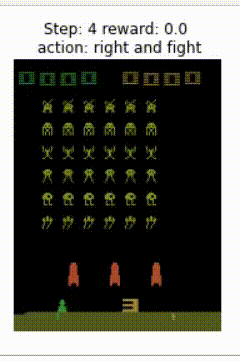
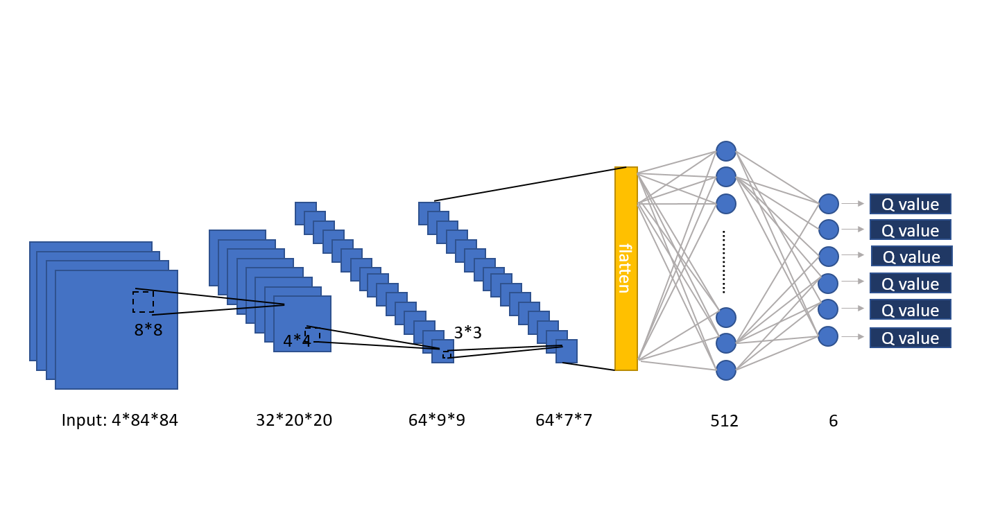
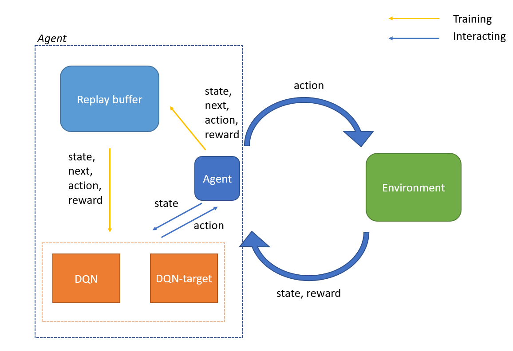
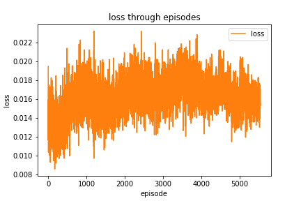
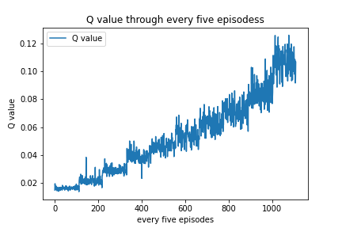
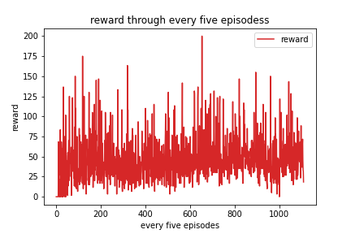

# 強化式學習(Reinforcement learning)玩 Space Invader
利用強化式學習 Reinforcement learning - Deep Q Network 學習玩 atari 的 Space Invader


## Acknowledgements
主要參考這篇 paper
- [Deep Reinforcement Learning to play Space Invaders](https://nihit.github.io/resources/spaceinvaders.pdf)


## Installation

|Package|Version|
|-------|--------|
|`torch`|1.9.0|
|`matplotlib`|3.4.2|
|`scikit-image`|0.15.0|
|`gym`|0.18.3|

單獨下載 gym 的 atari 環境

```bash
pip install gym[atari]
```

下載全部套件

```bash
pip install -r requirements.txt
```

## Getting Start
主程式在 `jupyter/SpaceInvader.ipynb`

## Demo
Playing Space Invader<br>
遊玩 Space Invader 的畫面<br>
(當母艦出現，agent會傾向去攻擊母艦，因為Q值最大)




## 前處理 Preprocessing
參考[Deep Reinforcement Learning to play Space Invaders](https://nihit.github.io/resources/spaceinvaders.pdf)方法，將 state 的大小 210 *  160 * 3 轉成 84 * 84 * 1，並作正規化，實作方法參考[這篇](https://skywalker0803r.medium.com/%E8%A8%93%E7%B7%B4dqn%E7%8E%A9atari-space-invaders-9bc0fc264f5b)


## Frame Skipping 技術
* 一次只輸入一張畫面的問題:
    - 靜態畫面難以透露動畫的資訊
    - 單張畫面會造成硬體(記憶體)負擔大

* 方法:<br>
*state 為每4張圖疊加，大小為 `4 * 84 * 84`*<br>
每經過4張畫面 agent 才進行判斷和做出 action<br>4張畫面的期間都用最新一次agent做的動作和env互動<br>
4張畫面內的變化並不會影響agent判斷太多，所以能成功<br>

* 優點:<br>
    - 帶有動畫資訊
    - 相同的時間和硬體成本能學到更多資訊<br>

* example:<br>
前一個 state 為 (frame1, frame2, frame3, frame4)<br>
下一個 state 為 (frame5, frame6, frame7, frame8)

## Experience Replay
* 同時互動同時訓練模型(On-policy)問題:<br>
    - 資料間可能會有時間上的correlation
    - 可能一直出現一樣的東西(例如賽車遊戲的直線道路)，導致模型overfitting
* Experience Replay:<br>
    - 打破資料時間上的correlation
    - 隨機取出experience，模型訓練變化更大的state，使模型更快收斂
* 作法:<br>
agent 在和 env 互動時並不會直接把 state, next state, action, reward 拿去訓練，而是存進 replay buffer，等到 replay buffer 有足夠多的互動經驗，agent 才從 replay buffer 中隨機取出 state, next state, action, reward 來訓練。
## 模型 Model
利用 2D Convolutional Neural Network 將輸入的 state 降維，再用 Fully Connected Neural Network 預測出6個動作的 Q value




## 學習過程 Training process


## 結果 Result




## Reference
- [Deep Reinforcement Learning to play Space Invaders](https://nihit.github.io/resources/spaceinvaders.pdf)
- [訓練DQN玩Atari Space Invaders](https://skywalker0803r.medium.com/%E8%A8%93%E7%B7%B4dqn%E7%8E%A9atari-space-invaders-9bc0fc264f5b)